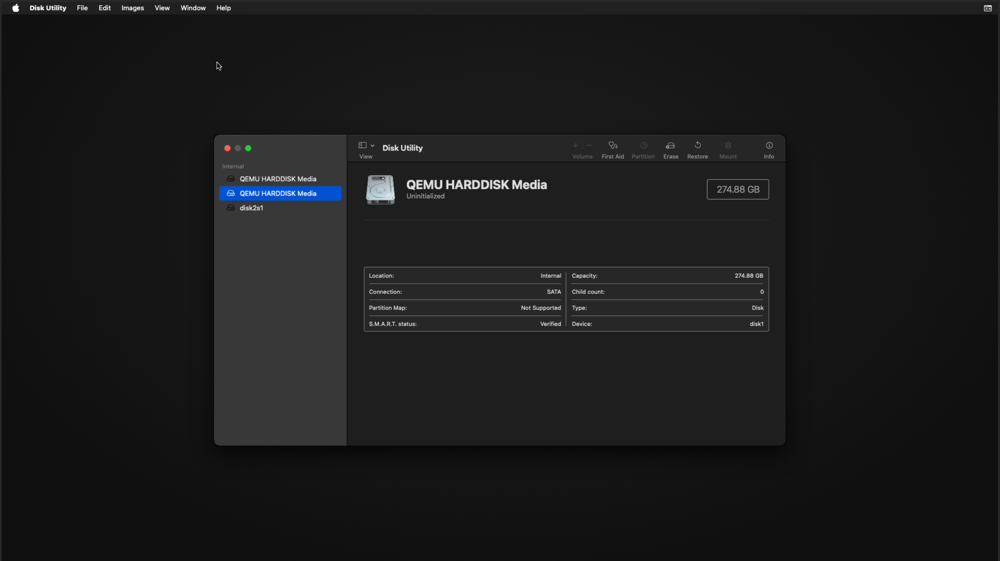
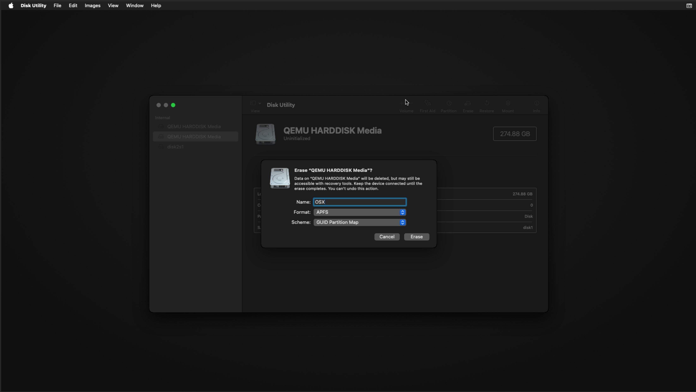
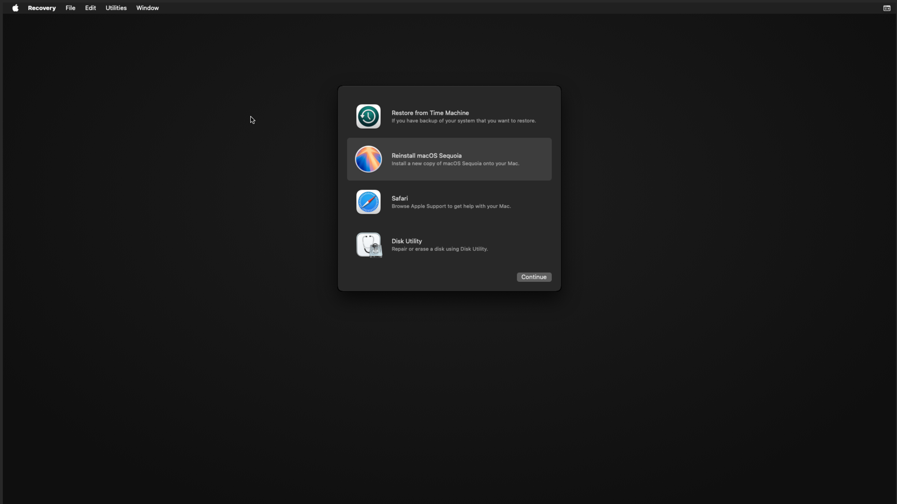
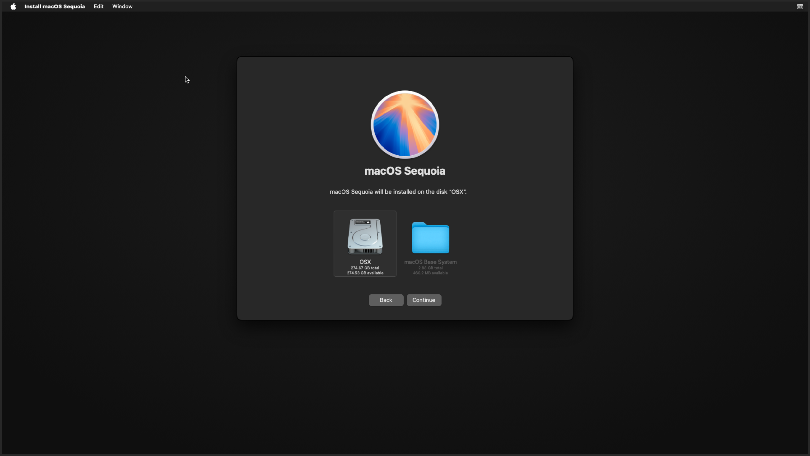

# Claude Cowork for Windows

Run **Claude Cowork** on Windows by running macOS in a Docker container.

> 📖 **Official Announcement:** [Cowork Research Preview](https://claude.com/blog/cowork-research-preview) - Anthropic's blog post introducing Claude Cowork

---

## TL;DR - Let Claude Do It

Don't want to read all these instructions? **Let Claude Code set everything up for you.**

### 1. Install Claude Code CLI on Windows

```powershell
irm https://claude.ai/install.ps1 | iex
```

That's it - one command. The installer handles everything automatically.

### 2. Tell Claude to do the rest

```powershell
claude
```

Then just say:

> "Clone https://github.com/tomchapin/claude-cowork-for-windows, read the README, and help me set up the macOS VM so I can run Claude Cowork."

Claude will read the instructions, check your system, enable KVM, start the container, and guide you through the macOS installation via VNC.

**That's the cheat code.** 🎮

---

## Why Use This?

[Claude Cowork](https://claude.ai/download) is Anthropic's revolutionary AI agent that can actually *use* your computer - reading files, editing documents, browsing the web, and automating complex workflows. It's like having an AI assistant that can do real work on your machine.

### What You Get

| Capability | Description |
|------------|-------------|
| **Claude Cowork** | Full agentic AI that reads, writes, and organizes files autonomously |
| **Claude Code** | Terminal-based coding assistant for software development |
| **Browser Automation** | Chrome/Safari access for web research, form filling, and browser agents |
| **Sandboxed Environment** | Safe isolation - let Claude experiment without risking your main system |
| **File Management** | Organize documents, process data, clean up folders automatically |
| **Full macOS** | Access to the entire Apple ecosystem and macOS-only applications |

### Why a Sandbox Matters

Running Cowork in a VM gives you a **safe playground** for AI experimentation:

- **Try risky operations** - Let Claude delete, move, or reorganize files without fear
- **Test automation scripts** - Run untested workflows in isolation
- **Browser agent experiments** - Let AI browse the web without exposing your real credentials
- **Learn safely** - Explore Cowork's capabilities knowing you can reset anytime
- **Disposable environment** - `docker-compose down -v` gives you a fresh start

### The Limitation

**Cowork only runs on macOS.** Anthropic hasn't released a Windows version yet.

### The Solution

This repo gives you a complete macOS virtual machine running inside Docker on your Windows PC. Connect via VNC, and you have full access to Cowork, Claude Code, Chrome, and everything else macOS offers.

```
┌──────────────────────────────────────────┐
│  Your Windows PC                         │
│  ┌────────────────────────────────────┐  │
│  │  Docker Desktop (WSL2)             │  │
│  │  ┌──────────────────────────────┐  │  │
│  │  │  macOS VM                    │  │  │
│  │  │  ┌────────────────────────┐  │  │  │
│  │  │  │    Claude Cowork       │  │  │  │
│  │  │  │    Claude Code         │  │  │  │
│  │  │  │    Chrome / Safari     │  │  │  │
│  │  │  │    Full macOS Desktop  │  │  │  │
│  │  │  └────────────────────────┘  │  │  │
│  │  └──────────────────────────────┘  │  │
│  └────────────────────────────────────┘  │
│                    ▲                     │
│         VNC Viewer (port 5999)           │
└──────────────────────────────────────────┘
```

## Requirements

- **Windows 10/11** with Docker Desktop (WSL2 backend)
- **Virtualization enabled** in BIOS (Intel VT-x / AMD-V/SVM)

**Recommended specs:**
- 8GB+ RAM available for the VM (4GB minimum, but will be slow)
- 64GB+ free disk space (can work with less)

Check virtualization:
```powershell
systeminfo | findstr /i "Virtualization"
# Should show: Virtualization Enabled In Firmware: Yes
```

### Enabling Virtualization in BIOS

If virtualization is not enabled, you'll need to enable it in your BIOS/UEFI settings:

**How to access BIOS:**
1. Restart your computer
2. Press the BIOS key repeatedly during startup (before Windows loads):
   - **Dell:** F2 or F12
   - **HP:** F10 or Esc
   - **Lenovo:** F1 or F2
   - **ASUS:** F2 or Del
   - **Acer:** F2 or Del
   - **MSI:** Del
   - **Gigabyte:** Del
3. Or from Windows: Settings → System → Recovery → Advanced startup → Restart now → Troubleshoot → Advanced options → UEFI Firmware Settings

**Settings to enable:**

For **Intel** CPUs, look for:
- `Intel Virtualization Technology` or `Intel VT-x` → **Enabled**
- `VT-d` or `Intel VT-d` → **Enabled** (if available)

For **AMD** CPUs, look for:
- `SVM Mode` or `AMD-V` → **Enabled**
- `IOMMU` → **Enabled** (if available)

These settings are typically found under:
- `Advanced` → `CPU Configuration`
- `Advanced` → `Processor Configuration`
- `Security` → `Virtualization`
- `BIOS Features` or `Advanced BIOS Features`

After enabling, save and exit (usually F10), then restart.

## Quick Start

### 1. Install Docker Desktop

1. Download **Docker Desktop** from [docker.com/products/docker-desktop](https://www.docker.com/products/docker-desktop/)
2. Run the installer and follow the prompts
3. **Important:** When asked, ensure **WSL 2** backend is selected (not Hyper-V)
4. Restart your computer if prompted
5. Launch Docker Desktop and wait for it to fully start (whale icon in system tray)

To verify Docker is working:
```powershell
docker --version
docker run hello-world
```

### 2. Enable KVM (required for macOS virtualization)

Run the included setup script:
```powershell
.\scripts\enable-kvm.ps1
```

Or manually: see [KVM Troubleshooting](#kvm-not-available-error) below.

### 3. Clone and start

```powershell
git clone https://github.com/tomchapin/claude-cowork-for-windows.git
cd claude-cowork-for-windows
docker-compose up -d
```

### 4. Wait for macOS to download and boot

First boot takes ~15-20 minutes (downloads macOS, then installs). Watch progress:
```powershell
docker-compose logs -f
```

### 5. Connect via VNC

Use any VNC client (all free and open source):
- **[TigerVNC](https://tigervnc.org/)** - Recommended, clean and fast
- **[TightVNC](https://www.tightvnc.com/)** - Classic and reliable
- **[UltraVNC](https://uvnc.com/)** - Feature-rich

Connect to:
```
localhost:5999
```

### 6. Install macOS (first time only)

On first boot, you'll see the macOS Recovery environment (you may see some `vm_shared_region` warnings - these are normal in a VM).

#### Step 6a: Open Disk Utility

When the macOS Utilities window appears, select **Disk Utility** and click **Continue**:


#### Step 6b: Select the virtual disk

In Disk Utility, find the **larger QEMU HARDDISK Media** in the sidebar (the ~200+ GB one, not the small ~3GB recovery partition). Select it:



#### Step 6c: Erase and format the disk

Click **Erase** and configure:
- **Name:** `OSX` (or any name you prefer)
- **Format:** `APFS`
- **Scheme:** `GUID Partition Map`

Then click **Erase**:



#### Step 6d: Reinstall macOS

Quit Disk Utility, then select **Reinstall macOS Sequoia** and click **Continue**:



#### Step 6e: Select installation disk

After agreeing to the license, select your newly formatted **OSX** disk (not the macOS Base System):



Click **Continue** and wait for installation to complete (~20-30 minutes).

The VM will reboot several times during installation. Your VNC connection may disconnect briefly - just reconnect to `localhost:5999`.

### 7. Complete macOS setup

After installation, follow the macOS setup wizard:
- Select your country/region
- Skip Apple ID (or sign in)
- Create a user account
- Complete remaining setup steps

### 8. Install Claude Cowork (Desktop App)

1. Open **Safari** in macOS
2. Go to https://claude.ai/download
3. Download and install the macOS app
4. Sign in with your Anthropic account

**Done! You now have Claude Cowork running on macOS in a virtualized sandbox on your Windows PC.**

---

### 9. (Optional) Install Claude Code CLI

> Skip this if you only want Cowork. Claude Code CLI is a separate terminal-based tool for developers.

Open **Terminal** (Cmd+Space, type "Terminal") and run:

```bash
curl -fsSL https://claude.ai/install.sh | bash
```

That's it - one command. The installer handles everything automatically.

## Usage

```powershell
# Start
docker-compose up -d

# Stop (preserves state)
docker-compose down

# View logs
docker-compose logs -f

# Fresh start (deletes everything)
docker-compose down -v
```

### Snapshots

Snapshots let you save the entire VM state - macOS installation, apps, files, everything. This is perfect for:
- **Saving a clean baseline** after initial setup
- **Before risky experiments** - restore if things go wrong
- **Multiple configurations** - switch between different setups

#### Create a Snapshot

```powershell
# Windows (PowerShell)
.\scripts\snapshot.ps1 -Name "clean-install" -Description "Fresh macOS with Cowork installed"

# Linux/macOS/WSL (Bash)
./scripts/snapshot.sh clean-install "Fresh macOS with Cowork installed"
```

The VM will stop during snapshot (for data consistency), then you can restart it.

#### List Available Snapshots

```powershell
# View all snapshots
dir snapshots\

# Or in bash
ls snapshots/
```

Each snapshot folder contains:
- `disk.tar.gz` - Compressed VM disk image
- `metadata.json` - Snapshot name, timestamp, description

#### Restore a Snapshot

```powershell
# Windows (PowerShell)
.\scripts\restore.ps1 -SnapshotName "clean-install_2026-01-13_18-30-00"

# Linux/macOS/WSL (Bash)
./scripts/restore.sh clean-install_2026-01-13_18-30-00
```

Run without arguments to see available snapshots:
```powershell
.\scripts\restore.ps1
```

> ⚠️ **Warning:** Restoring destroys the current VM state. Create a snapshot first if you want to keep it.

#### Recommended Snapshots

We recommend creating these snapshots as you set up:

| When | Snapshot Name | Why |
|------|---------------|-----|
| After macOS install | `fresh-macos` | Clean slate, no apps yet |
| After installing Cowork | `cowork-ready` | Ready to use, nothing configured |
| After your preferred setup | `my-baseline` | Your personalized environment |

#### Snapshot Storage

Snapshots are stored in the `snapshots/` folder and can be quite large (10-50GB+ depending on usage). You can:
- Move old snapshots to external storage
- Delete snapshots you no longer need: `rmdir /s snapshots\<snapshot_name>`

## Access

| Method | Address | Password |
|--------|---------|----------|
| VNC | localhost:5999 | (none) |
| SSH | localhost:50922 | alpine |

## Optional: Full Dev Environment

For a complete development setup (VS Code, Git, Rust, Python, etc.), run the included setup script inside macOS Terminal:

```bash
# Copy from shared folder and run
cp /Volumes/shared/setup-dev-environment.sh ~/
chmod +x ~/setup-dev-environment.sh
~/setup-dev-environment.sh
```

## Troubleshooting

### KVM not available error

If you see `error gathering device information while adding custom device "/dev/kvm"`, KVM needs to be enabled:

**Quick fix - run the helper script:**
```powershell
.\scripts\enable-kvm.ps1
```

**Manual fix:**

1. **Create/edit `%USERPROFILE%\.wslconfig`:**

   For AMD CPUs:
   ```ini
   [wsl2]
   nestedVirtualization=true
   kernelCommandLine=amd_iommu=on iommu=pt kvm.ignore_msrs=1 kvm-amd.nested=1
   ```

   For Intel CPUs:
   ```ini
   [wsl2]
   nestedVirtualization=true
   kernelCommandLine=kvm.ignore_msrs=1 kvm-intel.nested=1
   ```

2. **Restart WSL:**
   ```powershell
   wsl --shutdown
   ```

3. **Load KVM modules:**
   ```powershell
   # For AMD:
   wsl -d docker-desktop -e sh -c "modprobe kvm && modprobe kvm-amd"

   # For Intel:
   wsl -d docker-desktop -e sh -c "modprobe kvm && modprobe kvm-intel"
   ```

4. **If still not working, check BIOS settings:**
   - Enable **SVM** (AMD) or **VT-x** (Intel)
   - Enable **IOMMU** (may be called AMD-Vi or VT-d)
   - Save and reboot

### Slow boot

First boot is slow (~15-20 min) because it downloads macOS recovery files. The initial macOS installation takes another 20-30 minutes. After that, subsequent boots take 1-2 minutes.

### Can't connect VNC

Wait for macOS to fully boot. Check `docker-compose logs -f` to see boot progress.

During macOS installation, the VM reboots several times. If VNC disconnects, wait a few seconds and reconnect to `localhost:5999`.

### Shared folder not visible

The `./shared` folder mounts inside the container at `/mnt/shared`. To access it from macOS, you may need to use SSH/SFTP or configure file sharing.

## Legal

Running macOS in a VM is against Apple's EULA unless on Apple hardware. For personal/educational use only.

## Credits

- [sickcodes/Docker-OSX](https://github.com/sickcodes/Docker-OSX)
- [Anthropic Claude](https://claude.ai)

## License

MIT
